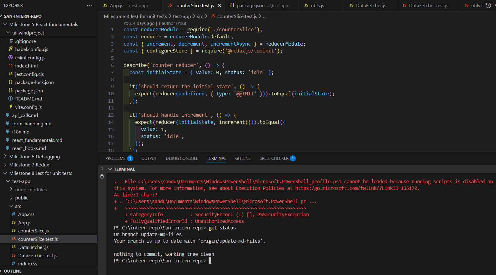
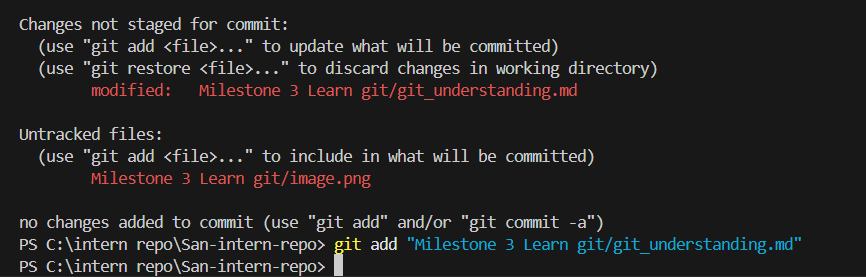
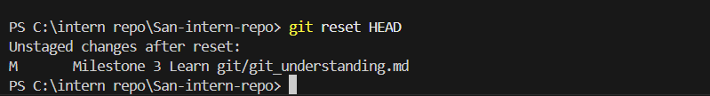
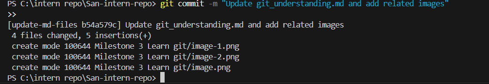

# Git Understanding

## What makes a good commit message?

- It should clearly state what the commit does.
- Include a summary and details (if needed): First line- short summary. Additional lines- more context if necessary.
- If relevant, link to issue numbers (e.g., Fixes #143)
- It should follow a consistent format

## How does a clear commit message help in team collaboration?

- It'll make code reviews easier when changes can be quickly understood.
- Clear messages help trace issues faster.
  – New team members can understand project history(Smoother onboarding).
- Efficient version control (useful when reverting or cherry-picking commits)

## How can poor commit messages cause issues later?

- Harder to track changes.
- Unclear history makes troubleshooting difficult.
- Hard to resolve conflicts if commit intent is unclear.
- Without meaningful commit messages, long-term maintainability suffers.

# git bisect

## What does git bisect do?

git bisect helps us find the commit that introduced a bug by performing a binary search through the commit history.
We specify a "bad" commit (where the bug exists) and a "good" commit (where the bug doesn't exist). Git then checks out the middle commit in the range for us to test.
We continue marking commits as "good" or "bad," and Git narrows down the range until it identifies the problematic commit.

## When would you use it in a real-world debugging situation?

- When its not sure which commit introduced the bug
  -When the bug appears after a series of changes, and manually reviewing all commits would be too time-consuming.

## How does it compare to manually reviewing commits?

git bisect is much faster because it halves the number of commits to check with each step (binary search), whereas manual review requires checking each commit one by one.

# Staging vs committing

## What is the difference between staging and committing?

Staging prepares changes by adding them to the staging area, allowing us to review and organize them before committing. Committing finalizes the staged changes, records them in the Git repository as a snapshot, and makes them part of the project’s history.

## Why does Git separate these two steps?

- The separation gives us control over which changes we want to commit and when.
- It reduces the chances of committing unwanted changes or mistakes.

## When would you want to stage changes without committing?

- when we want to stage certain changes without committing all changes in the working directory.
- when we're fixing bugs in multiple files but want to commit fixes for one file first, staging helps us manage that process.

# Branching & Team Collaboration

## Why is pushing directly to main problematic?

- It introduces the risk of breaking the main codebase
- It makes it harder to track changes and understand the history of updates

## How do branches help with reviewing code?

- Isolating changes, so reviewers can focus on specific features or fixes.
- Allowing testing in a separate environment before merging into main.
  -Preventing interference with other ongoing work on the main branch.

## What happens if two people edit the same file on different branches?

When merging, a merge conflict will occur if changes overlap.Git will ask to resolve the conflict manually, keeping only one version of the changes.This needs to be resolved before the merge can be completed successfully.

# Merge Conflicts & Conflict Resolution

## What caused the conflict?

I created a new branch called "Merge_conflicts" and I made a change in the Main branch (I added the line Merge conflicts-> :3) and commited it, then I tried to merge the "Merge_conflicts" branch into main .

The merge conflict occured because the same lines of git_understanding was modified in both branches. Since main and Merge_conflicts had changes in the same place, Git couldn't decide which version to keep.

## How did you resolve it?

I opened it in Merge editor and compared the differences and chose to ignore the line I added on the Main branch, then I completed the merge.

## What did you learn?

I learned when merging conflicts occur and how to resolve them and that ignoring a line during the merge means it won’t be in the final version of main.

# Advanced Git Commands & When to Use Them

## What does each command do?

- git checkout main -- <file> :
  It will replace the specified file in the working directory with the version from the main branch. Any local changes to that file are discarded.

- git cherry-pick <commit>:  
  Used to apply a specific commit from another branch without merging the whole branch.

- git log:
  It displays the commit history, showing commit messages, authors, timestamps, and commit hashes.

- git blame <file>:
  It shows line-by-line information about who last modified each line of a file and in which commit.

## When would you use it in a real project (hint: these are all really important in long running projects with multiple developers)?

- git checkout main -- <file> : Used when we want to discard local changes to a file and reset it to match main.
  AND if we accidentally modify a file and need to revert to the latest committed version from main.

- git cherry-pick <commit>: When we need to bring in a specific fix or feature from another branch without merging everything.

- git log: when we need to track recent commits and understand the project's history.

- git blame <file>: when we need to investigate a bug or regression to find out who made a particular change.

## What surprised you while testing these commands?

git checkout main -- <file> command wont work if we have staged (git add) the changes, we need to reset (git reset HEAD <file>) first.

# Creating & Reviewing Pull Requests

## Why are PRs important in a team workflow?

- PRs ensure code is reviewed before merging, reducing bugs and improving maintainability.
- Team members can provide feedback, learn from each other, and stay informed about changes.
- Helps keep track of what changes were made, by whom, and why, making debugging and auditing easier.
- Helps catch merge conflicts early and ensures smooth integration with the main branch.
  – Often triggers automated tests, linting, and security checks before merging.

## What makes a well-structured PR?

- Clear Title & Description
- Should contain only related changes, making it easier to review and test.
  – Adhering to team guidelines (e.g., formatting, naming conventions, best practices).
- Including Tests (If applicable, adds or updates unit/integration tests to cover changes)
- Linked to Relevant Issues/Tickets (References Jira, GitHub Issues, or other tracking tools for traceability).
- Screenshots/GIFs for UI Changes :Provides visuals for front-end modifications to make reviews quicker.
- Grouping related changes in logical commits with clear messages.
- Passes CI/CD Checks

## What did you learn from reviewing an open-source PR?

- Providing context in a PR: Meaningful title and description to help reviewers understand the changes. The placeholder text in the description mentioned adding a summary of the changes and a checklist mentioning specific steps to be followed before submitting, such as running tests, formatting code, running linters and completing the contributor license agreement (CLA). This helps ensure consistency, maintainability, and compliance with project guidelines.

# Evidence of using git commands:

1. Git status
   

2. git add:

3. git reset HEAD:
   

4. git commit:
   
