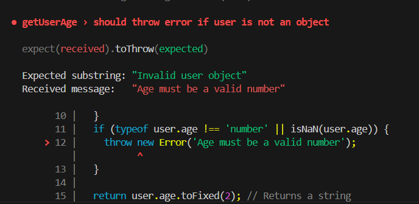
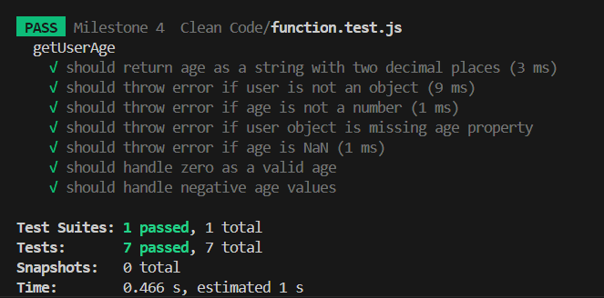

# Understanding Clean code Principles

## Example of a messy code

```js
function sumEvenNumbers(numbers) {
  return numbers.reduce((sum, num) => (num % 2 === 0 ? sum + num : sum), 0);
}

const numbersArray = [1, 2, 3, 4, 5, 6, 7, 8, 9, 10];
console.log(sumEvenNumbers(numbersArray));
```

## Its difficult to read because of:

- Poor naming: x, y, z don’t describe their purpose.
- No proper spacing or indentation
  -Inefficient structure: Could use reduce().

# Cleaner and more structured

```js
-function sumEvenNumbers(numbers) {
  return numbers.reduce((sum, num) => (num % 2 === 0 ? sum + num : sum), 0);
};

const numbersArray = [1, 2, 3, 4, 5, 6, 7, 8, 9, 10];
console.log(sumEvenNumbers(numbersArray));
```

# Code Formatting & Style Guides

## Why is code formatting important?

- Well-formatted code is easier to read and understand, making it simpler to follow logic and debug issues.
- Consistent formatting ensures that all team members write code in a similar style, reducing confusion and increasing collaboration.
- Helps in maintainability.
- Proper indentation and spacing help in identifying syntax errors or logical issues, reducing bugs.

## What issues did the linter detect?

In the code Ive named as 'Eslint_Prettier_Testcode.js', it detected that

- 'unusedVar' is assigned a value but never used
- 'userGreeting' is assigned a value but never used
- 'user.name' is missing in props validation

## Did formatting the code make it easier to read?

Yes it made the code more readable by fixing issues like one line functions.

# Naming Variables & Functions

## What makes a good variable or function name?

- Names which clearly convey the purpose of variable/function
- Using consistent naming conventions
- Concise names but informative
- Contextual relevance
- Using action verbs to indicate operations that functions perform

## What issues can arise from poorly named variables?

- Ambiguity makes it difficult to understand what the code does.
- Difficulty in maintaining or updating code with poorly named variables.
- Poorly named variables can lead to incorrect assumptions, and developers might misuse them, causing bugs that are difficult to track down.
- Mixing naming styles can create confusion for team members and reduce the uniformity of the codebase.

eg of poorly named variables and functions:

```js
def fn1(lst, x):
res = 0
for i in range(len(lst)):
if lst[i] > x:
res += lst[i]
return res

a = [5, 12, 7, 3, 15]
b = 10
c = fn1(a, b)
print(c)
```

Refactored code:

```js
def sum_elements_above_threshold(numbers, threshold):
total = 0
for num in numbers:
if num > threshold:
total += num
return total

values = [5, 12, 7, 3, 15]
limit = 10
result = sum_elements_above_threshold(values, limit)
print(result)
```

```Js
eg 2:
def doStuff(d, e):
f = 0
for g in d:
f += g \* e
return f

x = [2, 4, 6]
y = 3
z = doStuff(x, y)
print(z)
```

Refactored:

```js
def calculate_weighted_sum(numbers, multiplier):
weighted_sum = 0
for number in numbers:
weighted_sum += number \* multiplier
return weighted_sum

values = [2, 4, 6]
multiplier = 3
result = calculate_weighted_sum(values, multiplier)
print(result)
```

## How did refactoring improve code readability?

- It made the codes easier to understand at a glance since the variables and functions now convey their purpose.

# Writing Small, Focused Functions

## Why is breaking down functions beneficial?

- Improves readability.
- Modular functions can be reused in different parts of the code.
- Easier to locate and fix bugs in smaller, isolated functions.
- Updating or modifying a specific functionality is more manageable.
- Unit testing is more effective on small, independent functions.
- Each function handles a specific task, making the code more structured.

Example of a relatively long function:

```Js
function crawl(node, returnArray,depth, maxValue, parentOffset){
    const convertedNode = {
        "name": node.name,
        "width": node.value/maxValue,
        "offset": parentOffset,
        "color": COLORS[Math.floor(node.value/maxValue _ (COLORS.length - 1))]
};

        if (returnArray.length == depth){
            returnArray.push([convertedNode]);
        }else{
            returnArray[depth].push(convertedNode);
        }

        let offset = parentOffset;

        if (Array.isArray(node.children)){
            node.children.forEach(child => {
            const convertedChild = crawl(child, returnArray, depth + 1, maxValue, offset);
            offset += convertedChild.width;
        });
        }
        return convertedNode;

}

```

Refactored:

```Js
function convertNode(node, maxValue, parentOffset) {
    return {
        "name": node.name,
        "width": node.value / maxValue,
        "offset": parentOffset,
        "color": COLORS[Math.floor(node.value / maxValue * (COLORS.length - 1))]
    };
}

function addToReturnArray(node, returnArray, depth) {
    if (returnArray.length === depth) {
        returnArray.push([node]);
    } else {
        returnArray[depth].push(node);
    }
}

function crawl(node, returnArray, depth, maxValue, parentOffset) {
    const convertedNode = convertNode(node, maxValue, parentOffset);
    addToReturnArray(convertedNode, returnArray, depth);

    let currentOffset = parentOffset;

    if (Array.isArray(node.children)) {
        node.children.forEach(child => {
            currentOffset += crawl(child, returnArray, depth + 1, maxValue, currentOffset).width;
        });
    }

    return convertedNode;
}
```

## How did refactoring improve the structure of the code?

- Before, the original crawl function was doing too much: converting nodes, managing the return array, handling depth, and managing recursion. But now The logic is broken into smaller, more manageable functions:
- convertNode: Handles the logic for converting a node's properties.
- addToReturnArray: Manages the logic for adding nodes to the correct depth in the returnArray.
- crawl: Focuses solely on recursion and calling the helper functions for specific tasks.
- It is now easier to read and understand since each helper function has a single responsibility.

# Commenting & Documentation

## When should you add comments?

- When explaining complex logic.
- Describing why, not what(If the reason behind a decision isn't clear)
- Workarounds and hacks (If there's a temporary fix or an unusual approach)
- Public APIs or libraries (Provide usage details in functions, methods, or classes)

## When should you avoid comments and instead improve the code?

- If the code is self-explanatory, there's no need for a comment.
- When the variable names make sense.
- when a function is hard to understand, we should refactor it instead of adding comments.

# Handling Errors & Edge Cases

Eg of a function that doesn’t properly handle errors :

```Js
function getUserAge(user) {
  return user.age.toFixed(2); // No validation, may throw an error
}

const input = prompt("Enter your age: ");
const age = Number(input);
console.log(getUserAge({ age }));
```

Refactored:

```JS
function getUserAge(user) {
  if (!user || typeof user !== "object") throw new Error("Invalid user object"); // Guard clause
  if (typeof user.age !== "number" || isNaN(user.age)) throw new Error("Age must be a valid number");

  return user.age.toFixed(2); // Returns a string
}

try {
  const input = prompt("Enter your age:");
  const age = Number(input);

  if (isNaN(age)) throw new Error("Invalid input. Please enter a valid number.");

  console.log(getUserAge({ age }));
} catch (err) {
  console.error(err.message);
}
```

## How does handling errors improve reliability?

- By stopping unexpected inputs from breaking the app (preventing crashes).
- By helping with debugging (logging errors)
- By improving security by hiding sensitive info.
- Enhancing UX by displaying friendly error messages instead of blank screens.

# Avoiding Code Duplication

Example react component with unnecessary repetition:

```JSX
function UserProfile(){
    return(
        <div>
            <div className = "user-card">
                <h2>Roronoa Zoro</h2>
                <p>Email: zorojuro21@gmail.com</p>
            </div>
            <div className = "user-card">
                <h2>Nico Robin</h2>
                <p>Email: nicoya@gmail.com</p>
            </div>
            <div className = "user-card">
                <h2>Vinsmoke Sanji</h2>
                <p>Email: sanji3@gmail.com</p>
            </div>
        </div>
        );
}

export default UserProfile;
```

Refactored using the DRY principle:

```jsx
function UserProfile() {
  const users = [
    { name: 'Roronoa Zoro', Email: 'zorojuro21@gmail.com' },
    { name: 'Nico Robin', Email: 'nicoya@gmail.com' },
    { name: 'Vinsmoke Sanji', Email: 'sanji3@gmail.com' },
  ];

  return (
    <div>
      {users.map((user, index) => (
        <div key={index} className="user-card">
          <h2>{user.name}</h2>
          <p>Email: {user.Email}</p>
        </div>
      ))}
    </div>
  );
}

export default UserProfile;
```

## Issues with Duplicated Code:

- Repeated blocks of code makes the component harder to read and understand.
- Every instance of the user card would have to be updated if the structure of it changes (like adding a new field).
- Should manually add/update each repeated section if we want to add more users or change how the user cards are displayed. It is inefficient and error-prone.

## How did refactoring improve maintainability?

- By using .map() to iterate over an array of users, the repetition was eliminated. Now, each user card is created dynamically, reducing the need to manually repeat the same HTML structure.

- All user card logic is abstracted into a single template. If we need to update how each user card looks (e.g., adding new fields or changing the layout), we just need to make changes in one place, making the code easier to update and test.

- If more users are added to the array, the component will automatically adjust without needing any changes in the JSX. This makes it much easier to scale the app by adding or removing users from the list without editing the structure repeatedly.

# Refactoring Code for Simplicity:

Eg of an overly complicated code:

```Js

function calculateTotal(cart, discountPercentage) {
    let total = 0;
    if (cart.length > 0) {
        for (let i = 0; i < cart.length; i++) {
            let item = cart[i];
            if (item.quantity > 0) {
                for (let j = 0; j < item.quantity; j++) {
                    total += item.price;
                }
            }
        }
        if (discountPercentage > 0) {
            let discountAmount = (total * discountPercentage) / 100;
            total = total - discountAmount + discountAmount * 0;
        }
    } else {
        total = 0;
    }
    return total;
}
```

Refactored:

```Js
function calculateTotal(cart, discountPercentage) {
    let total = cart.reduce((sum, item) => sum + item.price * item.quantity, 0);
    let discountAmount = (total * discountPercentage) / 100;
    return total - discountAmount;
}
```

## What made the original code complex?

- It had unnecessary Loops: Iterates over item.quantity instead of simply multiplying.
- It had too many nested conditions that make it hard to read.
- Redundant Calculations: The discountAmount \* 0 does nothing.
- It had some unnecessary Checks: The if (cart.length > 0) is redundant; an empty array wouldn't affect the logic.

## How did refactoring improve it?

- Using the reduce() got rid of the unnecessary loop and made the summation easier.
- Removed Nested Conditionals since theres noo need to check for cart.length > 0 (reduce() handles empty arrays)
- Removing redundant operations made the discount calculation simple.

# Writing Unit Tests for Clean Code

## How do unit tests help keep code clean?

- By writing unit tests, bugs are caught early during development, preventing them from becoming larger issues later on.
- Encourage writing modular and well-structured code, since the code is often written in smaller, more manageable units to be tested.
- Unit tests can act as documentation, making it clear how different parts of the code are expected to behave.
- As the codebase evolves, unit tests help ensure that new changes don’t break existing functionality, making the code more maintainable.

## ## What issues did you find while testing?

I wrote 7 tests for a function I mentioned in 'function.js' and at first one out of the 7 failed. I got the error:



I found that the error is happening because getUserAge is not correctly handling the case where user is null or an empty array []. Specifically, null and [] are being passed as the user object, but JavaScript doesn't handle those the way we expect when we check for an object.

An empty array ([]) is an object in JavaScript, which causes the second check (typeof user.age !== 'number' || isNaN(user.age)) to be triggered instead of the first one (if (!user || typeof user !== 'object')).

The solution was to adjust the first condition to handle both null and array types explicitly.
so I changed it from

```js
if (!user || typeof user !== 'object') {
  throw new Error('Invalid user object');
}
```

to

```js
if (user === null || typeof user !== 'object' || Array.isArray(user)) {
  throw new Error('Invalid user object');
}
```

Then all the tests passed.

