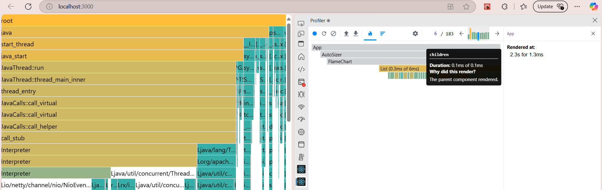

# Research Best Debugging Techniques for React

## What are the most common debugging techniques?

- Console Logging (console.log, warn, error): can get quick insights into state,props,variables.
- Breakpoints: from browser or VS Code debugger to pause and step through code.
- Reproducing bugs in a minimal version of the component or logic (isolation)
- Binary Search Debugging:Commenting out sections or reverting to previous versions to isolate issues.
- Using Error Messages & Stack Traces:tracing the way down starting from top of stack.
- Unit & Integration Testing.

## Which tools are most effective for React debugging?

- React DevTools: to inspect component tree, props, state, and hook values.
- React Profiler: help to spot performance bottlenecks and unnecessary re-renders.
  Eg use of react profiler (showing why certain components were rendered and duration)
  
- VS Code Debugger: step through logic and inspect real-time values.
- Browser DevTools: To inspect DOM, network requests, console logs, and JS execution.
- Error Boundaries:Catch and display fallback UIs for runtime errors.
- Linting Tools (ESLint): to catch syntax issues and bad practices before runtime.
- Logging & Monitoring Tools like entry, LogRocket, etc. help catch errors in production.

## How do you debug issues in large React codebases?

- We will first need to understand the component hierarchy and with React DevTools we can trace component structure and relationships.
- we can Track props/state/hook values using console.log() or DevTools.
- Create bug report or try reproducing the bug with minimal code to narrow down the problem.
- Using feature flags:isolate new changes to test only parts of the app.
- Stepping through with the debugger and log where expected behavior diverges.
- Using git blame or diffs to track when the bug was introduced.
- Moving the logic or component to a sandbox like CodeSandbox or Storybook.
